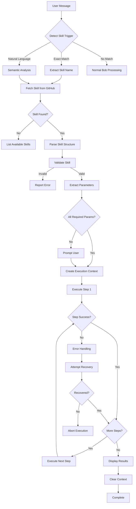

# Skill Executor System Design

## Overview

The Skill Executor is a system that enables Bob to automatically detect, fetch, and execute skills from the GitHub repository (`skillet-policies/.bob/skills/`) without storing them locally. This ensures skills cannot be tampered with and always execute the latest version from the source of truth.

## Key Requirements

1. **No Local Storage**: Skills are fetched from GitHub on-demand and stored only in memory during execution
2. **Keyword Detection**: Support both exact keywords (audit, list, install, etc.) and natural language triggers
3. **Automatic Execution**: Bob interprets and executes skill steps automatically
4. **Security**: Skills are read-only from GitHub, preventing local tampering
5. **Available Skills**: audit, init, install, list, search, uninstall, update

---

## Architecture Components

### 1. Skill Detection System

**Purpose**: Detect when a user message contains a skill execution trigger

**Detection Methods**:

#### A. Exact Keyword Matching

- Pattern: `^(bob\s+)?(audit|init|install|list|search|uninstall|update)(\s+.*)?$`
- Examples:
  - "bob audit"
  - "audit"
  - "install frontend-css-to-tailwind-transformer"
  - "list --outdated"

#### B. Natural Language Detection

- Use semantic analysis to detect skill intent
- Patterns:
  - "can you audit my skills" → audit
  - "show me all skills" → list
  - "install the css transformer" → install
  - "search for authentication" → search
  - "update everything" → update
  - "remove that skill" → uninstall
  - "set up my workspace" → init

**Implementation Strategy**:

```typescript
interface SkillTrigger {
  skillName: string;
  confidence: number; // 0-1
  extractedParams: Record<string, any>;
}

function detectSkillTrigger(userMessage: string): SkillTrigger | null {
  // 1. Try exact keyword match first (highest confidence)
  const exactMatch = matchExactKeyword(userMessage);
  if (exactMatch) return { ...exactMatch, confidence: 1.0 };

  // 2. Try natural language detection (lower confidence)
  const nlMatch = matchNaturalLanguage(userMessage);
  if (nlMatch && nlMatch.confidence > 0.7) return nlMatch;

  return null;
}
```

---

### 2. Skill Fetching Mechanism

**Purpose**: Retrieve skill content from GitHub using MCP server

**Process**:

1. Detect skill trigger (e.g., "audit")
2. Construct GitHub path: `skillet-policies/.bob/skills/{skill-name}.md`
3. Use MCP tool `read_policy_file` to fetch skill content
4. Parse skill markdown into structured format
5. Store in memory for execution (never write to disk)

**MCP Integration**:

```xml
<use_mcp_tool>
<server_name>skillet-github</server_name>
<tool_name>read_policy_file</tool_name>
<arguments>
{
  "path": ".bob/skills/audit.md"
}
</arguments>
</use_mcp_tool>
```

**Skill Structure Parsing**:

```typescript
interface ParsedSkill {
  name: string;
  description: string;
  version: string;
  category: string;
  roles: string[];
  prerequisites: string[];
  inputs: SkillInput[];
  steps: SkillStep[];
  outputs: string[];
  examples: SkillExample[];
  notes: string[];
  warnings: string[];
  relatedSkills: string[];
}

interface SkillStep {
  number: number;
  title: string;
  instructions: string[];
  tools: string[]; // Bob tools to use
  expectedOutcome: string;
}
```

---

### 3. Skill Step Interpreter

**Purpose**: Convert skill steps into executable Bob actions

**Interpretation Logic**:

Each skill step contains imperative instructions that map to Bob tools:

| Skill Instruction Pattern              | Bob Tool              | Example               |
| -------------------------------------- | --------------------- | --------------------- |
| "Use the `read_file` tool"             | read_file             | Read skill content    |
| "Use the `write_to_file` tool"         | write_to_file         | Create config file    |
| "Use the `list_files` tool"            | list_files            | List installed skills |
| "Use the MCP tool `read_skill_file`"   | use_mcp_tool          | Fetch from GitHub     |
| "Use the `ask_followup_question` tool" | ask_followup_question | Get user input        |
| "Use the `execute_command` tool"       | execute_command       | Run CLI commands      |
| "Use the `apply_diff` tool"            | apply_diff            | Modify files          |
| "Use the `insert_content` tool"        | insert_content        | Add lines to files    |

**Execution Engine**:

```typescript
async function executeSkillStep(
  step: SkillStep,
  context: ExecutionContext,
): Promise<StepResult> {
  // 1. Parse step instructions to identify required tools
  const toolCalls = parseToolCalls(step.instructions);

  // 2. Extract parameters from context and user input
  const params = extractParameters(step, context);

  // 3. Execute each tool call sequentially
  for (const toolCall of toolCalls) {
    const result = await executeTool(toolCall.tool, toolCall.params);

    // 4. Update context with results
    context.update(result);

    // 5. Check for errors
    if (result.error) {
      return { success: false, error: result.error };
    }
  }

  return { success: true, context };
}
```

---

### 4. Parameter Extraction

**Purpose**: Extract required parameters from user message and context

**Parameter Sources**:

1. **User Message**: Direct parameters in the trigger message
   - "install frontend-css-to-tailwind-transformer" → skill_name
   - "list --outdated" → outdated_only = true
   - "update --all" → update_all = true

2. **Interactive Prompts**: Ask user for missing required parameters
   - Use `ask_followup_question` tool
   - Provide intelligent suggestions based on context

3. **Context**: Infer from workspace state
   - Developer tier from workspace config
   - Installed skills from file system
   - Current mode from Bob state

**Example**:

```typescript
interface ParameterExtractor {
  extract(userMessage: string, skill: ParsedSkill): SkillParameters;
}

// For "install frontend-css-to-tailwind-transformer"
{
  skill_name: "frontend-css-to-tailwind-transformer", // from message
  // Other params use defaults or prompt user
}

// For "list --outdated"
{
  outdated_only: true, // from flag
  category: undefined  // optional, not provided
}
```

---

### 5. Execution Context

**Purpose**: Maintain state during skill execution

**Context Structure**:

```typescript
interface ExecutionContext {
  // Skill metadata
  skillName: string;
  skillVersion: string;

  // Execution state
  currentStep: number;
  completedSteps: number[];

  // Parameters
  inputs: Record<string, any>;

  // Results
  outputs: Record<string, any>;

  // Workspace info
  workspaceDir: string;
  developerTier: string;
  installedSkills: string[];

  // Temporary data (in-memory only)
  skillContent: string;
  parsedSkill: ParsedSkill;

  // Methods
  update(result: any): void;
  getVariable(name: string): any;
  setVariable(name: string, value: any): void;
}
```

---

### 6. Security Measures

**In-Memory Only Storage**:

- Skill content is fetched from GitHub and stored in `ExecutionContext`
- Never written to local file system
- Context is cleared after execution completes
- No caching mechanism to prevent tampering

**Read-Only Access**:

- Skills are fetched using `read_policy_file` (read-only MCP tool)
- No write access to GitHub repository during execution
- Skills cannot modify themselves

**Validation**:

- Verify skill structure before execution
- Check for required sections (Version, Category, Steps, etc.)
- Validate tool calls against allowed Bob tools
- Prevent arbitrary code execution

**Example Security Flow**:

```typescript
async function executeSkill(skillName: string, userMessage: string) {
  // 1. Fetch skill from GitHub (read-only)
  const skillContent = await fetchSkillFromGitHub(skillName);

  // 2. Store in memory only
  const context = new ExecutionContext();
  context.skillContent = skillContent;
  context.parsedSkill = parseSkill(skillContent);

  // 3. Validate skill structure
  if (!validateSkill(context.parsedSkill)) {
    throw new Error("Invalid skill structure");
  }

  // 4. Execute steps
  await executeSteps(context);

  // 5. Clear context (automatic garbage collection)
  // No explicit cleanup needed - context goes out of scope
}
```

---

### 7. Error Handling

**Error Types**:

1. **Skill Not Found**
   - Skill name doesn't exist in repository
   - Action: List available skills, suggest similar names

2. **MCP Connection Error**
   - GitHub MCP server not connected
   - Action: Prompt user to connect MCP server

3. **Missing Parameters**
   - Required input not provided
   - Action: Use `ask_followup_question` to collect

4. **Tool Execution Error**
   - Bob tool fails during execution
   - Action: Log error, attempt recovery, or abort

5. **Validation Error**
   - Skill structure invalid
   - Action: Report to user, suggest manual review

**Fallback Strategies**:

```typescript
async function executeWithFallback(skillName: string, userMessage: string) {
  try {
    return await executeSkill(skillName, userMessage);
  } catch (error) {
    if (error instanceof SkillNotFoundError) {
      // Fallback: List available skills
      return await listAvailableSkills();
    } else if (error instanceof MCPConnectionError) {
      // Fallback: Provide connection instructions
      return await provideMCPSetupInstructions();
    } else if (error instanceof MissingParameterError) {
      // Fallback: Prompt for missing parameter
      return await promptForParameter(error.parameterName);
    } else {
      // Generic fallback: Report error and suggest manual execution
      return await reportErrorAndSuggestManual(error);
    }
  }
}
```

---

### 8. Integration with Bob Modes

**Mode Compatibility**:

| Mode         | Skill Execution Support | Notes                       |
| ------------ | ----------------------- | --------------------------- |
| Plan         | ✅ Full Support         | Can use all MCP tools       |
| Advanced     | ✅ Full Support         | Can use all MCP tools       |
| Code         | ❌ Limited              | No MCP tools available      |
| Ask          | ✅ Full Support         | Can use all MCP tools       |
| Orchestrator | ✅ Full Support         | Can delegate to other modes |

**Mode-Specific Behavior**:

**Plan Mode**:

- Execute skills that involve planning and design
- Can fetch and analyze skills
- Can create todo lists based on skill steps

**Advanced Mode**:

- Full skill execution capability
- Can use MCP tools and browser tools
- Ideal for complex skill workflows

**Code Mode**:

- Limited skill execution (no MCP access)
- Can only execute skills that don't require GitHub fetching
- Should switch to Advanced mode for full skill execution

**Ask Mode**:

- Can explain skills and their usage
- Can fetch and display skill content
- Limited execution (read-only operations)

**Orchestrator Mode**:

- Can coordinate multi-skill workflows
- Can delegate skill execution to appropriate modes
- Can manage complex skill dependencies

---

### 9. Workflow Diagram



---

## Implementation Plan

### Phase 1: Core Detection System

1. Create skill trigger detection function
2. Implement exact keyword matching
3. Add natural language detection
4. Test with all 7 skill keywords

### Phase 2: Skill Fetching

1. Integrate with MCP `read_policy_file` tool
2. Implement skill content parsing
3. Create in-memory storage structure
4. Add validation logic

### Phase 3: Step Interpreter

1. Build tool call parser
2. Map skill instructions to Bob tools
3. Implement parameter extraction
4. Create execution engine

### Phase 4: Execution Context

1. Design context structure
2. Implement state management
3. Add variable storage
4. Create context lifecycle management

### Phase 5: Error Handling

1. Define error types
2. Implement fallback strategies
3. Add recovery mechanisms
4. Create user-friendly error messages

### Phase 6: Mode Integration

1. Add mode compatibility checks
2. Implement mode-specific behaviors
3. Create mode switching logic
4. Test across all modes

### Phase 7: Testing & Refinement

1. Test each skill individually
2. Test parameter extraction
3. Test error scenarios
4. Optimize performance

---

## Usage Examples

### Example 1: Audit Skills

```
User: "bob audit"

Bob Process:
1. Detect trigger: "audit" (exact match)
2. Fetch: skillet-policies/.bob/skills/audit.md
3. Parse skill structure
4. Extract parameters: fix=false, registry=false (defaults)
5. Execute steps:
   - Read skill-index.json from GitHub
   - Read business rules and policies
   - Scan for outdated skills
   - Check for conflicts
   - Verify tier restrictions
   - Check policy compliance
   - Generate audit report
6. Display results
7. Clear context
```

### Example 2: Install Skill (Natural Language)

```
User: "hey bob, can you install the css transformer skill?"

Bob Process:
1. Detect trigger: "install" (natural language, confidence: 0.85)
2. Extract parameter: skill_name = "css transformer" (fuzzy match)
3. Fetch: skillet-policies/.bob/skills/install.md
4. Parse skill structure
5. Execute steps:
   - Read skill-index.json
   - Find skill entry (match "css transformer" → "frontend-css-to-tailwind-transformer")
   - Fetch skill from GitHub
   - Write to local workspace
   - Display installation summary
6. Clear context
```

### Example 3: List Skills with Filters

```
User: "list --outdated"

Bob Process:
1. Detect trigger: "list" (exact match)
2. Extract parameters: outdated_only=true
3. Fetch: skillet-policies/.bob/skills/list.md
4. Parse skill structure
5. Execute steps:
   - Read skill-index.json
   - List installed skills
   - Compare versions
   - Apply filters (outdated only)
   - Group by category
   - Format output
6. Display results
7. Clear context
```

---

## Security Considerations

### Threat Model

**Threat 1: Local Skill Tampering**

- **Risk**: User modifies local skill files to execute malicious code
- **Mitigation**: Never store skills locally; always fetch from GitHub
- **Status**: ✅ Mitigated

**Threat 2: Man-in-the-Middle Attack**

- **Risk**: Attacker intercepts GitHub requests and injects malicious skills
- **Mitigation**: Use HTTPS for all GitHub requests; verify MCP server authenticity
- **Status**: ✅ Mitigated (handled by MCP/GitHub)

**Threat 3: Malicious Skill in Repository**

- **Risk**: Compromised GitHub repository contains malicious skills
- **Mitigation**: Repository access control; code review process; skill validation
- **Status**: ⚠️ Requires organizational security policies

**Threat 4: Arbitrary Code Execution**

- **Risk**: Skill instructions execute arbitrary system commands
- **Mitigation**: Whitelist allowed Bob tools; validate tool parameters; sandbox execution
- **Status**: ✅ Mitigated (Bob's tool system is sandboxed)

### Best Practices

1. **Always Fetch Fresh**: Never cache skills locally
2. **Validate Before Execute**: Check skill structure and tool calls
3. **Limit Tool Access**: Only allow whitelisted Bob tools
4. **Audit Logs**: Log all skill executions for security review
5. **User Confirmation**: Prompt for confirmation on destructive operations
6. **Error Isolation**: Prevent error messages from leaking sensitive info

---

## Performance Considerations

### Optimization Strategies

1. **Lazy Loading**: Only fetch skill when needed
2. **Parallel Fetching**: Fetch multiple skills concurrently if needed
3. **Efficient Parsing**: Use streaming parser for large skills
4. **Context Reuse**: Reuse context for multi-step operations
5. **Early Validation**: Validate skill structure before execution

### Expected Performance

- **Skill Detection**: < 100ms
- **Skill Fetching**: 200-500ms (network dependent)
- **Skill Parsing**: < 50ms
- **Step Execution**: Varies by step complexity
- **Total Overhead**: ~300-600ms per skill execution

---

## Future Enhancements

1. **Skill Caching**: Optional in-memory cache with TTL (security trade-off)
2. **Skill Versioning**: Support executing specific skill versions
3. **Skill Composition**: Chain multiple skills together
4. **Skill Analytics**: Track skill usage and success rates
5. **Skill Recommendations**: Suggest skills based on user behavior
6. **Skill Marketplace**: Community-contributed skills
7. **Skill Testing**: Automated testing framework for skills
8. **Skill Debugging**: Step-by-step execution with breakpoints

---

## Conclusion

The Skill Executor system provides a secure, efficient way for Bob to automatically execute skills from the GitHub repository without local storage. By combining keyword detection, MCP integration, and intelligent step interpretation, Bob can seamlessly execute complex workflows while maintaining security and preventing tampering.

The system is designed to be:

- **Secure**: No local storage, read-only access, validated execution
- **Flexible**: Supports exact keywords and natural language
- **Reliable**: Comprehensive error handling and fallback strategies
- **Performant**: Optimized for fast execution with minimal overhead
- **Extensible**: Easy to add new skills and capabilities

This design ensures that skills remain the single source of truth in the GitHub repository while providing a smooth user experience for skill execution.
